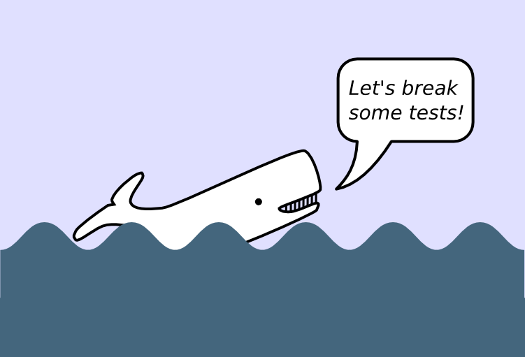

# Python Testing Tutorial

## I love Cologne

This tutorial helps you to learn automated testing in Python 3 using the `pytest` framework.



## Goal: Count Words in Moby Dick

*Captain Ahab was vicious because Moby Dick, the white whale, had bitten off his leg. So the captain set sail for a hunt. For months he was searching the sea for the white whale. The captain finally attacked the whale with a harpoon. Unimpressed, the whale devoured captain, crew and ship. The whale won.*


Herman Melville's book *“Moby Dick”* describes the epic fight between the captain of a whaling ship and a whale. In the book, the whale wins by eating most of the other characters. **But does he also win by being mentioned more often?**

**In this course, you will test a program that is counting words in Melville's book.**


## Preparations

clone the repository:

```shell
git clone https://github.com/bonartm/python_testing_tutorial.git
```

install **pytest**:

```shell
pip install pytest
```

## Chapters

* [Unit Tests](articles/unit_tests.md)
* [Fixtures](articles/fixtures.md)
* [Parameterized Tests](articles/parameterized.md)
* [Organizing Tests](articles/organizing_tests.md)
* [Test Coverage](articles/test_coverage.md)
* [Recap Puzzle](articles/find_pairs.md)

## Appendix

* [Quotes on Testing](articles/quotes.md)
* [Instructions for Trainers](articles/instructions_for_trainers.md)

## Links

* [Python Testing Tutorial](https://katyhuff.github.io/python-testing/) - by Kathryn Huff
* [Introduction to pytest](https://www.youtube.com/watch?v=UPanUFVFfzY) - by Michael Tom-Wing and Christie Wilson
* [Test & Code Podcast](http://testandcode.com/) - by Brian Okken
* [The Clean Code Talks – Unit Testing](http://www.youtube.com/watch?v=wEhu57pih5w&feature=channel)
* [Test-Driven-Development](https://www.youtube.com/watch?v=L4hOiGOKSxQ) - by H.Percival


## Sources

Sources for this tutorial: [github.com/krother/python_testing_tutorial](https://github.com/krother/python_testing_tutorial).

## Copyright

Feedback and comments are welcome at: [krother@academis.eu](mailto:krother@academis.eu)

© 2018 Magdalena & Kristian Rother

Released under the conditions of a Creative Commons
Attribution License 4.0.

## Contributors

Kristian Rother, Magdalena Rother, Daniel Szoska
