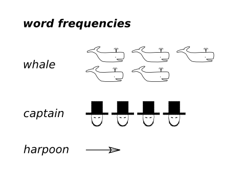

# Counting Words in Moby Dick

## Moby Dick: Plot synopsis
*Captain Ahab was vicious because Moby Dick, the white whale, had bitten off his leg. So the captain set sail for a hunt. For months he was searching the sea for the white whale. The captain finally attacked the whale with a harpoon. Unimpressed, the whale devoured captain, crew and ship. The whale won.*

#### Video
[Moby Dick short synopsis on Youtube](https://www.youtube.com/watch?v=EFPhnR5CZtc)

## Course Objective
Herman Melville's book *“Moby Dick”* describes the epic fight between the captain of a whaling ship and a whale. In the book, the whale wins by eating most of the other characters.

**But does he also win by being mentioned more often?**

In this course, you have a program that analyzes the text of Melville's book.

**You will test whether the program work correctly?**

## Why was this example selected?

Three main reasons:

* The implementation is simple enough for beginners.
* Counting words easily yields different results (because of upper/lower case, special characters etc). Therefore the program needs to be thoroughly tested.
* You can easily change the theme to another book from [Project Gutenberg](http://www.gutenberg.org/).
